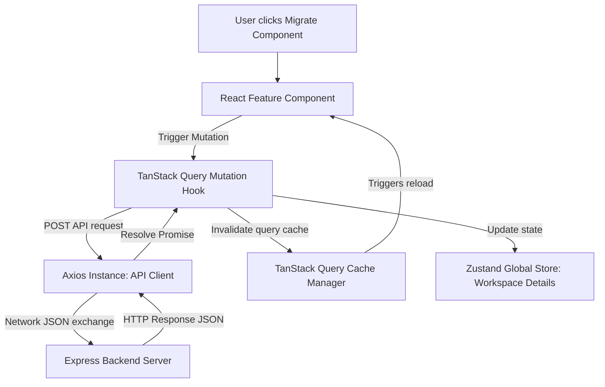
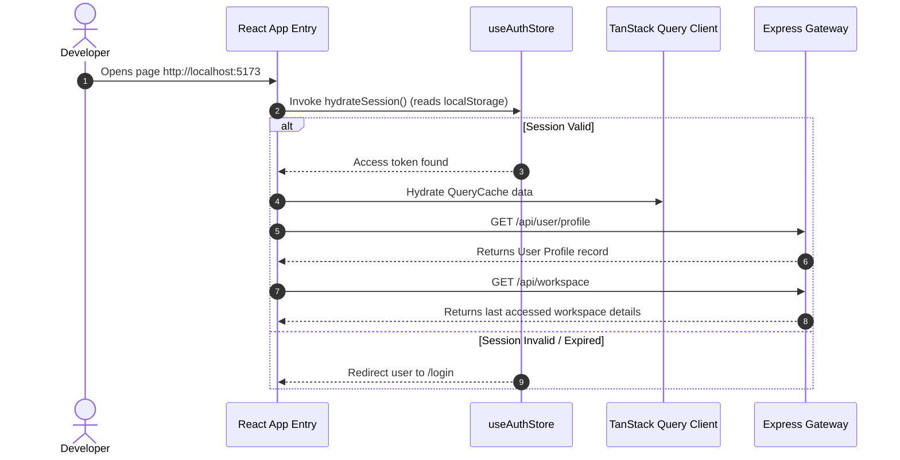

# Module 26: Frontend Architecture & SPA Layout

## 1. Executive Summary

This document specifies the client-side SPA (Single Page Application) software architecture, state managers, API query layers, caching strategies, and routing controls of the **Frontend Studio Portal** for the **AI Code Migration Studio** platform. The application is built with React, Vite, TypeScript, Tailwind CSS, and shadcn/ui components. It uses **Zustand** for local state management and **TanStack Query** for caching server requests.

---

## 2. Directory Structure & Layout

The frontend codebase is organized by feature area to keep files modular and maintainable:

```markdown
packages/frontend/src/
├── animations/         # Framer Motion transitions and styles
├── app/                # React App entry points & global providers
├── components/         # Shared UI elements (buttons, inputs, cards)
├── features/           # Feature modules: auth, dashboard, compiler
├── hooks/              # Reusable React hooks
├── lib/                # Client configurations (axios, react-flow settings)
├── services/           # Axios API connectors
├── shared/             # Global TypeScript interface definitions
├── store/              # Zustand global store files
└── utils/              # Helper utilities
```

---

## 3. Frontend Architecture Flowchart

The frontend coordinates user events, global state updates, and server requests through a structured flow:



---

## 4. State Management Store Segments

The frontend divides global store files into distinct slices using Zustand to prevent unnecessary component re-renders:

| Store Slice | Primary Responsibility | Key States Tracked |
| :--- | :--- | :--- |
| **`useAuthStore`** | User login sessions, tokens. | `accessToken`, `currentUser`, `isAuthenticated` |
| **`useWorkspaceStore`**| Active workspace data, members. | `currentWorkspace`, `membersList`, `roles` |
| **`useJobStore`** | Migration jobs queues, logs. | `activeJobs`, `jobHistory`, `compilationProgress` |
| **`useGraphStore`** | Dependency graphs, coordinates. | `nodes`, `edges`, `circularDependencies` |

---

## 5. Sequence Diagram: Workspace State Hydration
This sequence diagram shows how the frontend loads user credentials and workspace data during application boot.



---

## 6. Best Practices

- **Use Query Keys Consistently**: Use structured array query keys (e.g., `['workspaces', workspaceId, 'projects']`) in TanStack Query to keep caching and invalidations predictable.
- **Implement Axios Interceptors**: Add request and response interceptors to Axios to automatically attach JWT access tokens and trigger token refreshes on `401 Unauthorized` responses.
- **Enforce Strict Type Safety**: Ensure all API responses are fully typed with TypeScript interfaces rather than falling back to `any`.
- **Set Long Stale Times**: Set long `staleTime` values (e.g., `5 minutes`) in TanStack Query for static reference data (like framework versions) to reduce unnecessary API requests.
