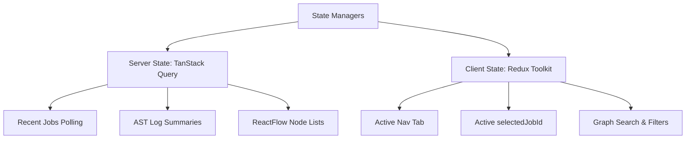

# 🎨 Code Migration Tool - Frontend Interface

Welcome to the frontend workspace of the **Multi-Framework Code Migration Studio**. This interface provides an enterprise-ready dashboard to upload legacy code projects, choose target translation frameworks, explore symbols dependency architectures, and audit AI self-healing patch logs.

---


## 🏛️ Architecture Overview

The frontend follows a **Feature-First Architecture** designed to keep components decoupled, self-contained, and highly maintainable. Business domains are grouped under self-contained directories inside `src/features`, while reusable visual assets, styling rules, and state managers sit in the `src/shared`, `src/app`, and `src/store` hubs.

```
src/
├── app/                  # Application bootstrap & provider wrapping configurations
├── features/             # Self-contained domain specific logic, APIs, and views
│   ├── upload/           # Zip files drag-and-drop parser
│   ├── migration/        # Codemod mappings and AST settings configs
│   ├── jobs/             # Recents job list, log sidebar, and download API links
│   ├── reports/          # Self-healing corrections logs, code explorer, and file diffs
│   └── dependency-graph/ # ReactFlow symbol relationships chart
├── shared/               # Globally reusable layout panels, utility helpers, and common widgets
│   ├── components/       # Buttons, Cards, Badges, Progress bars, Skeletons, Sidebars
│   ├── types/            # Shared interfaces (api.types.ts)
│   └── hooks/            # Shared client hooks (useDebounce, useLocalStorage)
├── store/                # Client state configuration (Redux Toolkit)
└── services/             # Core connection utilities
    └── http/             # Axios-based httpClient with timeout, header rules, and interceptors
```

---

## 🧠 State Management Strategy

We maintain a strict boundary between **Server State** and **Client/Global State**:



### 1. Server State (TanStack Query)
TanStack Query manages all data cached or fetched from the backend API.
* **Retries & Caching**: Configured with a default `staleTime` of 10s and a retry rate of 1 to keep connection drops from crashing the client.
* **Keys**: Uses structured, array-based query keys for automatic refetch triggers (e.g., `['graph', jobId, page, search, filter]`).
* **Conventions**: No components perform direct fetch/axios queries. All actions are handled via custom queries and mutation hooks:
  * `useRecentJobs()`: Polls job lists every 5 seconds.
  * `useJob(jobId)`: Polls active progress status every 2 seconds during processing.
  * `useUpload()`: Trigger mutation to upload files and invalidates `recentJobs` queries upon starting.
  * `useDependencyGraph(...)`: Tracks paginated symbol nodes.
  * `useMigrationReport(jobId)`: Loads logs only after a job completes.

### 2. Client/Global State (Redux Toolkit)
Redux manages ephemeral client-side UI states that do not require server storage.
* **Conventions**: Redux store slices are defined under `src/store/slices/`.
* **Hooks**: Components import typed selectors and dispatcher hooks (`useAppSelector` and `useAppDispatch`).
* **Active Slices**:
  * `uiSlice`: Manages active navigation tabs (`activeTab`).
  * `workspaceSlice`: Manages the selected active job UUID (`selectedJobId`).
  * `graphSlice`: Tracks dependency graph states (`search`, `filter`, `page`, `selectedNode`).

---

## 💻 Coding Standards & Best Practices

1. **Component Scopes**: Limit component files to **150–250 lines**. Over-sized views are broken down into granular widgets.
2. **Strict Memoization**:
   * All heavy components use `React.memo()` to prevent cascading re-renders during background polling.
   * Event handlers and array mappings inside render loops are wrapped in `useCallback()` and `useMemo()` with stable reference keys.
3. **No Unused Imports**: Strictly adhere to `noUnusedLocals` and `noUnusedParameters` rules.
4. **TypeScript Safety**: Avoid `any` castings or implicit `any` signatures. Declare explicit parameter type mappings to keep strict check parameters green.

---

## ⚡ Development Workflow

### Installation
Populate local dependencies using the package manager:
```bash
npm install
```

### Run Dev Server
Launch Vite's hot-reload server:
```bash
npm run dev
```
*(Runs on http://localhost:3000, proxies `/api` to backend service)*

### Cleanup Deprecated Structures
Remove older component-centric directories:
```bash
npm run clean
```

### Production Build
Lint and build static production assets:
```bash
npm run build
```
